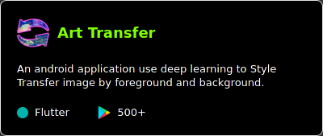

<h1 align="center">Hi , I'm Quy, Dang Quoc </h1>
<h3 align="center">Scripting & Automation | Data Engineer</h3>

<!--  -->

    

## 👦 &nbsp;About me:
- 🎓 I'm a **Computer Science** student (graduating in November 2021) at <a href="https://www.uit.edu.vn/"> <b>VNUHCM-University of Information Technology</b>, Vietnam</a>.
- 📱 I like to make apps for **Android** with Flutter.
- 🌐 I also like to use **Selenium Python** to create automatic scripts for websites.
- 💡 I'm interested in all things data: **Big Data, Cloud, Machine Learning and Data Science**.
- 🌱 I’m currently pursuing **Data Engineer** on [**Datacamp**](https://learn.datacamp.com/career-tracks/data-engineer-with-python?version=3).
- 🏃‍♂️ I love **running** so much.

## 🧰 &nbsp;Used everyday
OS|DE|Shell|Code Editor|Web Browsers
|:--:|:--:|:--:|:--:|:--:|
|||||

<!-- ## 📕 &nbsp;My Latest Blog posts:
- link 1
- link 2 -->

## 🔥 &nbsp;Recent Releases

- ### Google Play Apps

---

- ### Github Repositories

## 🛠 &nbsp;Skill Set 

These are some of the major technologies that I use or have worked on in the past:

**Programming Languages**

||
|--|--|

**Libraries and Frameworks**

|||
|--|--|--|--|

**Cloud**

|
|--|--|

**Databases**

|
|--|--|

**Tools**

|
|--|--|

 

<h2> 📊 &nbsp;GitHub Analytics </h2>

|
|--|--|

<b>Note:</b> Most Used Languages is only a metric of the languages my public code consists of and doesn't reflect experience or skill level.

